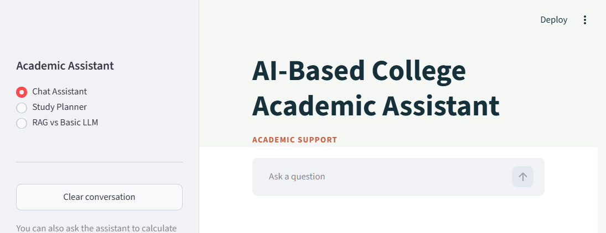
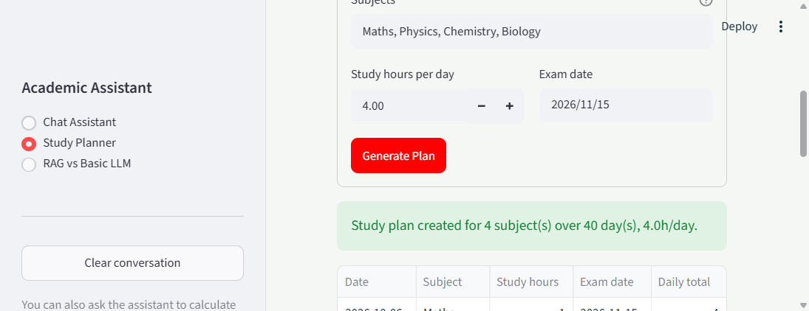
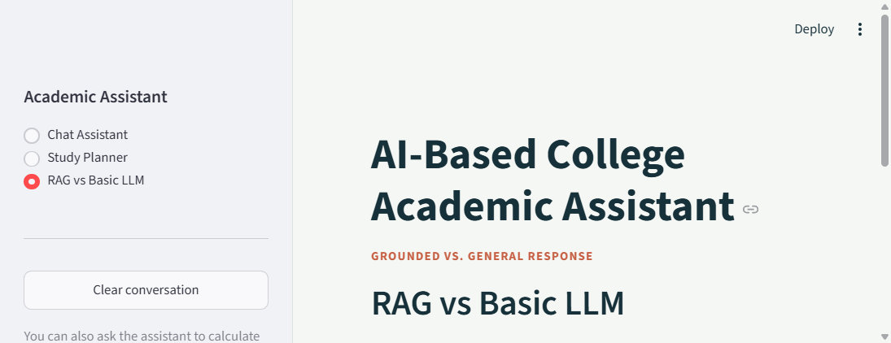

# AI-Based College Academic Assistant

A college-focused assistant that answers questions from supplied academic PDFs, creates study plans, calculates CGPA, and manages academic calendar events. The Streamlit interface calls a small Python adapter, which routes requests through the existing LangGraph workflow and backend modules.

## Architecture

```mermaid
flowchart LR
    subgraph Build[Document indexing]
        PDFs[College PDFs] --> Loader[PDF loading and cleaning]
        Loader --> Splitter[Text chunking]
        Splitter --> Embedder[Hugging Face embeddings]
        Embedder --> Chroma[(Chroma vector database)]
    end

    Student[Student] --> UI[Streamlit UI]
    UI --> API[backend_api.py]
    API --> LoadHistory[LangGraph: load_history]
    LoadHistory --> Classify[LangGraph: classify]
    Classify -->|document question| RAGNode[LangGraph: rag]
    Classify -->|study plan| PlanNode[LangGraph: plan]
    Classify -->|CGPA| CgpaNode[LangGraph: cgpa]
    Classify -->|calendar| CalendarNode[LangGraph: calendar]

    RAGNode --> Retriever[LangChain retriever and RAG context]
    Chroma --> Retriever
    Retriever --> Prompt[Grounded prompt with retrieved passages]
    Prompt --> LLM[OpenAI-compatible chat model]
    LLM --> RAGNode

    PlanNode --> Planner[src/planner.py]
    CgpaNode --> Tools[src/tools.py]
    CalendarNode --> Tools
    RAGNode --> SaveHistory[LangGraph: save_history]
    PlanNode --> SaveHistory
    CgpaNode --> SaveHistory
    CalendarNode --> SaveHistory
    SaveHistory --> API
    API --> UI
```



LangChain components handle PDF loading, splitting, embeddings, Chroma access, and retrieval. The RAG generation call uses the configured OpenAI-compatible chat API. LangGraph routes requests to RAG, planning, CGPA, or calendar nodes; it does not currently include a separate review node.

## Setup

Run these commands from the repository root in PowerShell:

```powershell
python -m venv venv
venv\Scripts\Activate.ps1
python -m pip install -r requirements.txt
Copy-Item .env.example .env
```

Edit `.env` and configure:

| Variable | Required | Purpose |
|---|---|---|
| `LLM_API_KEY` | Yes | API key for the selected OpenAI-compatible provider |
| `LLM_MODEL` | Yes | Chat model name, for example the model shown in `.env.example` |
| `LLM_BASE_URL` | Provider-dependent | API base URL; use the sample Groq endpoint for Groq, or leave unset for OpenAI |

Never commit `.env` or share its key. The embedding model (`sentence-transformers/all-MiniLM-L6-v2`) is downloaded locally on first use; it does not require an API key.

Put searchable, text-based college PDFs in `data/documents/`. The supplied documents are `academic_regulations.pdf`, `internship_guidelines.pdf`, and `student_faq.pdf`.

## Run

Build or rebuild the Chroma index after adding or changing PDFs. This resets and recreates the configured collection:

```powershell
python src\build_vector_db.py
```

Start the Streamlit interface:

```powershell
streamlit run app.py
```

Useful checks and comparison scripts:

```powershell
python -m pytest tests -v
python -m pytest tests/test_assistant.py tests/test_planner.py tests/test_person4.py -v
python -m pytest tests/test_app.py -v
python src\test_retrieval.py
python run_test_report.py
python compare_llm_vs_rag.py
```

`run_test_report.py` writes `test_results.csv`; `compare_llm_vs_rag.py` writes `comparison_results.csv` and `comparison_report.md`. Live RAG checks require the vector database and LLM configuration. The generated `vector_db/` directory is local and should be rebuilt by each developer.

`tests/test_assistant.py`, `tests/test_planner.py`, and `tests/test_person4.py` cover routing, schedule generation, tools, and memory. `tests/test_app.py` contains 15 end-to-end scenarios across direct questions, follow-ups, cited RAG answers, unknown questions, and multi-step study-plan requests. Those live cases need the configured LLM and built vector database.

## UI Screenshots

### Chat Assistant



### Study Planner



### RAG vs Basic LLM



## Project Structure

```text
.
├── app.py                    # Streamlit interface
├── backend_api.py            # Frontend-facing backend functions
├── compare_llm_vs_rag.py     # Basic LLM/RAG comparison and report generation
├── run_test_report.py        # Scenario runner that writes test_results.csv
├── requirements.txt
├── data/
│   └── documents/            # Source PDFs
├── src/
│   ├── assistant.py          # LangGraph state, routing, and nodes
│   ├── build_vector_db.py    # Index builder
│   ├── chat.py               # Command-line RAG chat
│   ├── config.py             # Paths and indexing settings
│   ├── document_loader.py    # PDF extraction and cleaning
│   ├── embeddings.py         # Local embedding model
│   ├── memory.py             # JSON-backed session conversation history
│   ├── planner.py            # Deterministic study planner
│   ├── prompts.py            # RAG grounding instructions
│   ├── rag_chain.py          # Retrieval, prompt, and LLM answer
│   ├── retriever.py          # Chroma search functions
│   ├── test_rag.py           # RAG smoke check
│   ├── test_retrieval.py     # Retrieval checks
│   ├── text_splitter.py      # Recursive document chunking
│   └── tools.py              # CGPA and calendar functions
└── tests/
    ├── test_app.py           # Document-grounded live scenarios
    ├── test_assistant.py     # LangGraph routing tests
    ├── test_person4.py       # Tools and memory tests
    └── test_planner.py       # Planner tests
```

Runtime files such as `vector_db/`, `data/chat_memory.json`, and `data/calendar_events.json` are local data and are not source-controlled.

## Team Modules

| Member | Area | Main modules |
|---|---|---|
| Person 1 | Document processing and vector database | `src/config.py`, `src/document_loader.py`, `src/text_splitter.py`, `src/embeddings.py`, `src/build_vector_db.py`, `src/retriever.py` |
| Person 2 | Retrieval-augmented generation | `src/rag_chain.py`, `src/prompts.py`, `src/test_rag.py` |
| Person 3 | LangGraph workflow and study planner | `src/assistant.py`, `src/planner.py` |
| Person 4 | External tools and conversation memory | `src/tools.py`, `src/memory.py` |
| Person 5 | Frontend, integration, and testing | `app.py`, `backend_api.py`, `tests/`, `run_test_report.py`, `compare_llm_vs_rag.py` |

## Notes and Limitations

- The current document set contains regulations, internship guidelines, and FAQs; no syllabus PDF is included yet.
- Scanned/image-only PDFs need OCR. The loader warns when a page has no readable text, and tables may lose layout during extraction.
- The default CGPA grade-point mapping in `src/tools.py` should be checked against official college rules.
- Study-plan modification uses an LLM to update subjects, dates, and daily hours. Per-subject revision intensity is not represented by the current planner data model.
- Conversation and calendar JSON files are local application storage, not a multi-user database.
